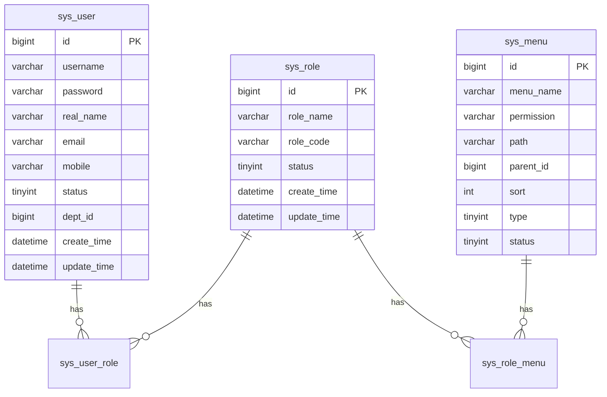
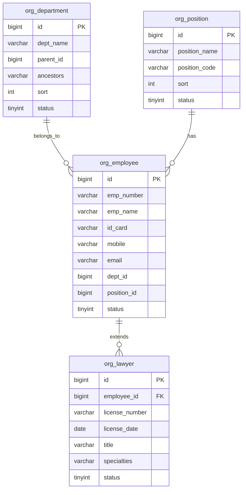
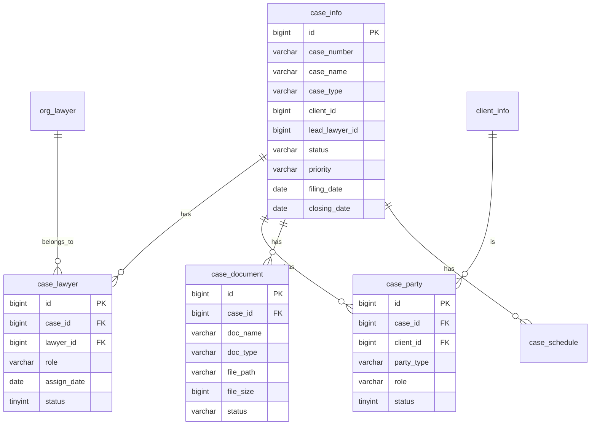
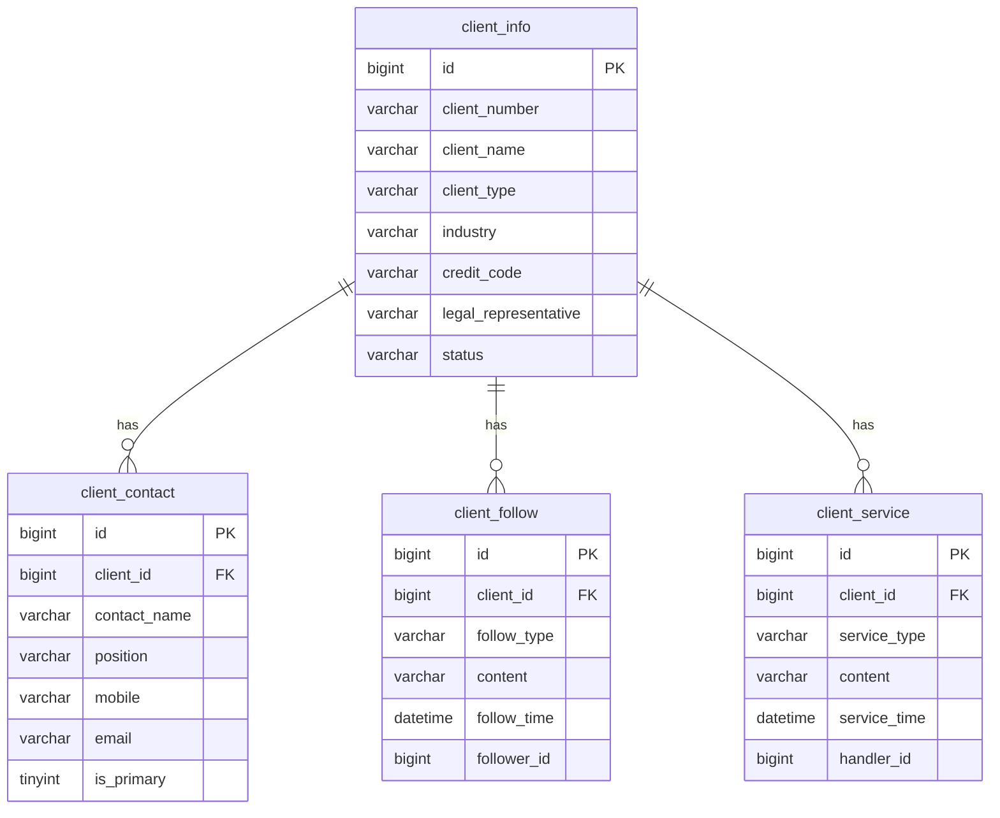
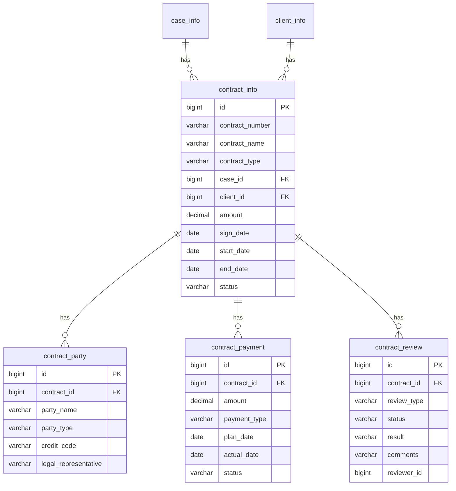
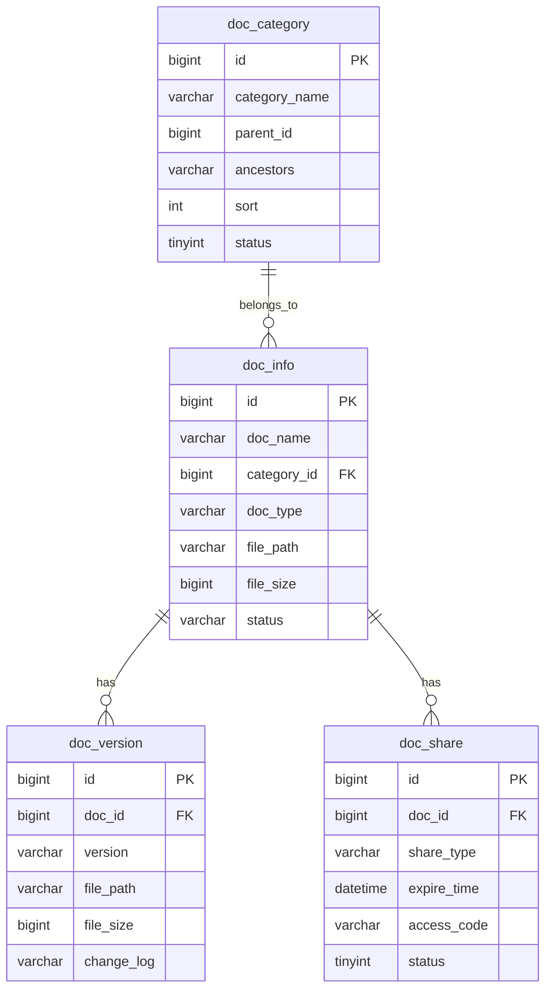
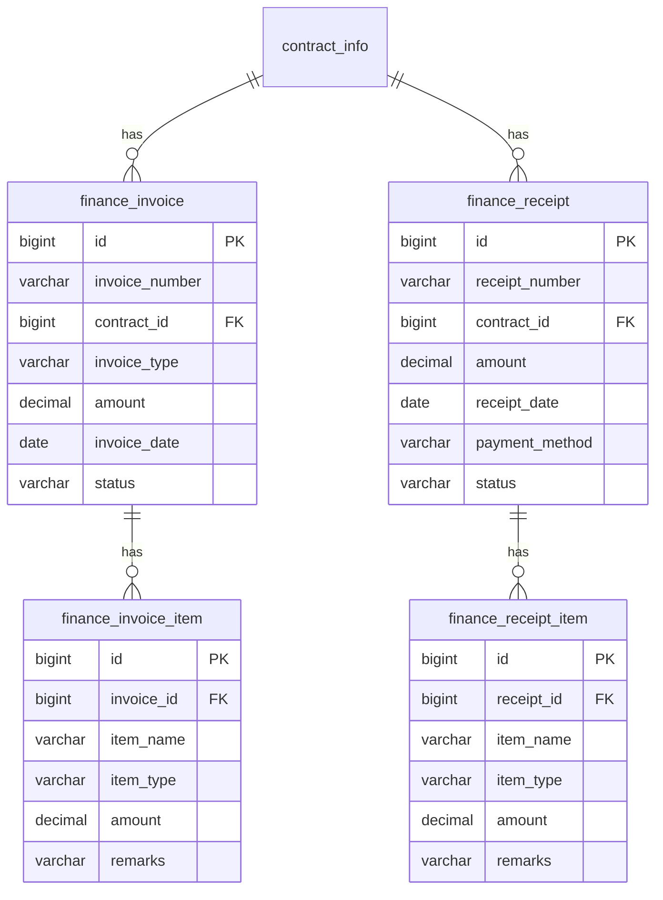

# 数据库ER关系图

## 系统管理模块

```mermaid
erDiagram
    sys_user ||--o{ sys_user_role : has
    sys_role ||--o{ sys_user_role : has
    sys_role ||--o{ sys_role_menu : has
    sys_menu ||--o{ sys_role_menu : has
    
    sys_user {
        bigint id PK
        varchar username
        varchar password
        varchar real_name
        varchar email
        varchar mobile
        tinyint status
        bigint dept_id
        datetime create_time
        datetime update_time
    }
    
    sys_role {
        bigint id PK
        varchar role_name
        varchar role_code
        tinyint status
        datetime create_time
        datetime update_time
    }
    
    sys_menu {
        bigint id PK
        varchar menu_name
        varchar permission
        varchar path
        bigint parent_id
        int sort
        tinyint type
        tinyint status
    }
```

## 组织架构模块

```mermaid
erDiagram
    org_department ||--o{ org_employee : belongs_to
    org_position ||--o{ org_employee : has
    org_employee ||--o{ org_lawyer : extends
    
    org_department {
        bigint id PK
        varchar dept_name
        bigint parent_id
        varchar ancestors
        int sort
        tinyint status
    }
    
    org_position {
        bigint id PK
        varchar position_name
        varchar position_code
        int sort
        tinyint status
    }
    
    org_employee {
        bigint id PK
        varchar emp_number
        varchar emp_name
        varchar id_card
        varchar mobile
        varchar email
        bigint dept_id
        bigint position_id
        tinyint status
    }
    
    org_lawyer {
        bigint id PK
        bigint employee_id FK
        varchar license_number
        date license_date
        varchar title
        varchar specialties
        tinyint status
    }
```

## 案件管理模块

```mermaid
erDiagram
    case_info ||--o{ case_lawyer : has
    case_info ||--o{ case_party : has
    case_info ||--o{ case_document : has
    case_info ||--o{ case_schedule : has
    org_lawyer ||--o{ case_lawyer : belongs_to
    client_info ||--o{ case_party : is
    
    case_info {
        bigint id PK
        varchar case_number
        varchar case_name
        varchar case_type
        bigint client_id
        bigint lead_lawyer_id
        varchar status
        varchar priority
        date filing_date
        date closing_date
    }
    
    case_lawyer {
        bigint id PK
        bigint case_id FK
        bigint lawyer_id FK
        varchar role
        date assign_date
        tinyint status
    }
    
    case_party {
        bigint id PK
        bigint case_id FK
        bigint client_id FK
        varchar party_type
        varchar role
        tinyint status
    }
    
    case_document {
        bigint id PK
        bigint case_id FK
        varchar doc_name
        varchar doc_type
        varchar file_path
        bigint file_size
        varchar status
    }
```

## 客户管理模块

```mermaid
erDiagram
    client_info ||--o{ client_contact : has
    client_info ||--o{ client_follow : has
    client_info ||--o{ client_service : has
    
    client_info {
        bigint id PK
        varchar client_number
        varchar client_name
        varchar client_type
        varchar industry
        varchar credit_code
        varchar legal_representative
        varchar status
    }
    
    client_contact {
        bigint id PK
        bigint client_id FK
        varchar contact_name
        varchar position
        varchar mobile
        varchar email
        tinyint is_primary
    }
    
    client_follow {
        bigint id PK
        bigint client_id FK
        varchar follow_type
        varchar content
        datetime follow_time
        bigint follower_id
    }
    
    client_service {
        bigint id PK
        bigint client_id FK
        varchar service_type
        varchar content
        datetime service_time
        bigint handler_id
    }
```

## 合同管理模块

```mermaid
erDiagram
    contract_info ||--o{ contract_party : has
    contract_info ||--o{ contract_payment : has
    contract_info ||--o{ contract_review : has
    case_info ||--o{ contract_info : has
    client_info ||--o{ contract_info : has
    
    contract_info {
        bigint id PK
        varchar contract_number
        varchar contract_name
        varchar contract_type
        bigint case_id FK
        bigint client_id FK
        decimal amount
        date sign_date
        date start_date
        date end_date
        varchar status
    }
    
    contract_party {
        bigint id PK
        bigint contract_id FK
        varchar party_name
        varchar party_type
        varchar credit_code
        varchar legal_representative
    }
    
    contract_payment {
        bigint id PK
        bigint contract_id FK
        decimal amount
        varchar payment_type
        date plan_date
        date actual_date
        varchar status
    }
    
    contract_review {
        bigint id PK
        bigint contract_id FK
        varchar review_type
        varchar status
        varchar result
        varchar comments
        bigint reviewer_id
    }
```

## 文档管理模块

```mermaid
erDiagram
    doc_category ||--o{ doc_info : belongs_to
    doc_info ||--o{ doc_version : has
    doc_info ||--o{ doc_share : has
    
    doc_category {
        bigint id PK
        varchar category_name
        bigint parent_id
        varchar ancestors
        int sort
        tinyint status
    }
    
    doc_info {
        bigint id PK
        varchar doc_name
        bigint category_id FK
        varchar doc_type
        varchar file_path
        bigint file_size
        varchar status
    }
    
    doc_version {
        bigint id PK
        bigint doc_id FK
        varchar version
        varchar file_path
        bigint file_size
        varchar change_log
    }
    
    doc_share {
        bigint id PK
        bigint doc_id FK
        varchar share_type
        datetime expire_time
        varchar access_code
        tinyint status
    }
```

## 财务管理模块

```mermaid
erDiagram
    finance_invoice ||--o{ finance_invoice_item : has
    finance_receipt ||--o{ finance_receipt_item : has
    contract_info ||--o{ finance_invoice : has
    contract_info ||--o{ finance_receipt : has
    
    finance_invoice {
        bigint id PK
        varchar invoice_number
        bigint contract_id FK
        varchar invoice_type
        decimal amount
        date invoice_date
        varchar status
    }
    
    finance_invoice_item {
        bigint id PK
        bigint invoice_id FK
        varchar item_name
        varchar item_type
        decimal amount
        varchar remarks
    }
    
    finance_receipt {
        bigint id PK
        varchar receipt_number
        bigint contract_id FK
        decimal amount
        date receipt_date
        varchar payment_method
        varchar status
    }
    
    finance_receipt_item {
        bigint id PK
        bigint receipt_id FK
        varchar item_name
        varchar item_type
        decimal amount
        varchar remarks
    }
``` 